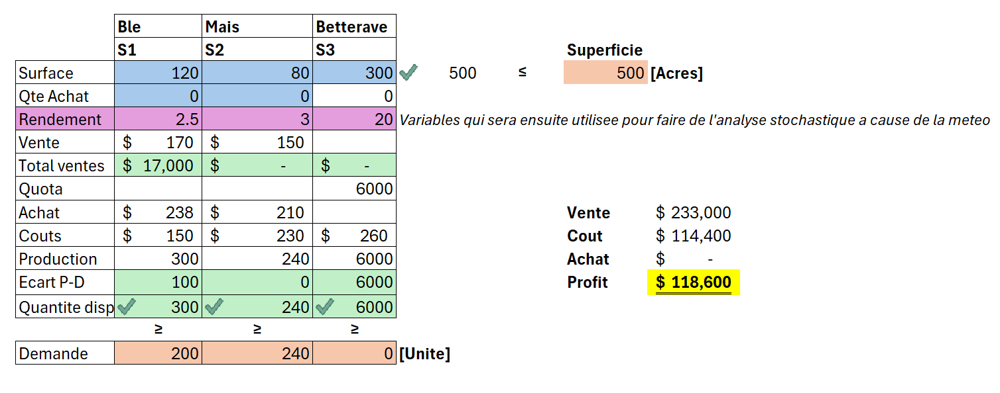

## My Projects

---
---
### Deploiement d'un model IA
[*<small>IA Deployment</small>*](/pages/deploiement_ia)

    <!-- <a href="/pages/deploiement_ia"><i><small>IA Deployment</small></i></a>   -->
    
        

---

### Recherche operationnelle - Operations research
[*<small>BioFerme</small>*](/pages/BioFerme/BioFerme) 

 

        
         

_L'objectif etant de maximiser les profits tout en balancant avec les contraintes, afin de produire de la biomasse. On utilisera une approche deterministe dans un premier temps pour ensuite pousser la reflexion avec eds approches stochastiq...._ 

---

### Data science and data analytics 

[*<small>EcoEnergy</small>*](/pages/Ecoenergy/ecoenergy) 

        
         

---

[*<small>Flights delays and Cancellation prediction</small>*](/pages/FlightsDelaysandCancellation/FlightsDelays) 

        
         

---

### Natural Language processing

[*<small>Analyse des revues liees a la Covid sous differentes perspectives</small>*](/pages/deploiement_ia) 

        
         

---

### Cours Statistique

- [Notions en Appentissage Statistiques](/pages/NotionsStatistiques/Introduction_Apprentissage_statistique)

<!-- - [Project 2 Title](http://example.com/)
- [Project 3 Title](http://example.com/)
- [Project 4 Title](http://example.com/)
- [Project 5 Title](http://example.com/) -->

<!-- --- -->

<!-- ---
### Tout savoir sur Git
[Project 1 Title](/pages/sample_page_copy)

 -->

---
<!--
Page template forked from <a href="https://github.com/evanca/quick-portfolio">Here</a>
-->
<!-- Remove above link if you don't want to attibute -->
